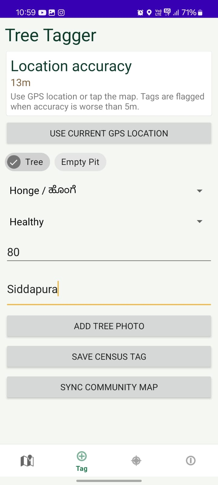
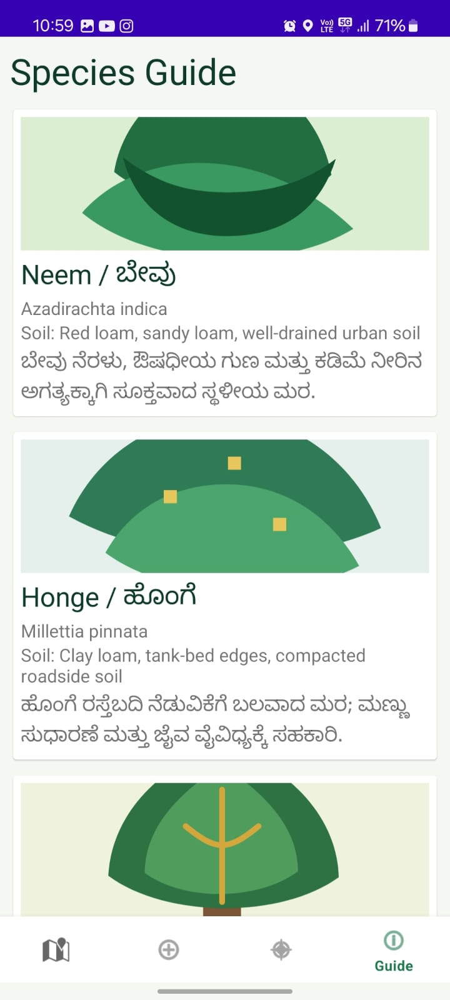
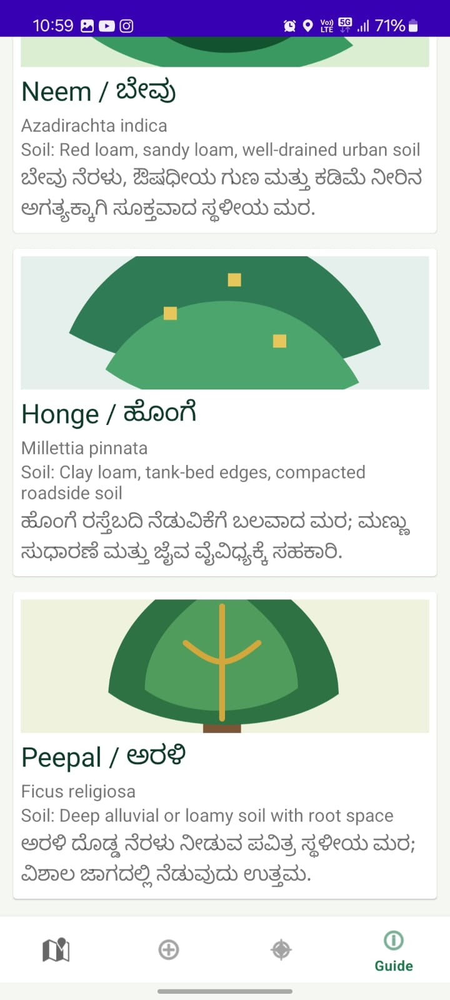
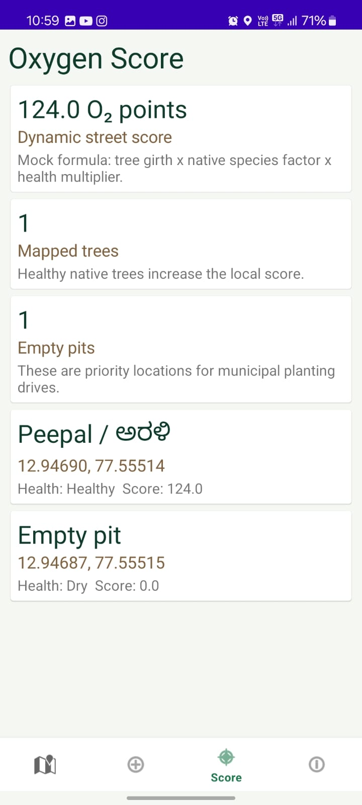

# 🌿 Hasiru Usiru – Community Green Auditor for Bengaluru and Mysuru

Hasiru Usiru is an Android application developed using Kotlin that enables citizens and communities to participate in urban green auditing. The app allows users to map trees, identify empty planting pits, track environmental data, and contribute toward improving urban greenery in Bengaluru and Mysuru.

The goal of this project is to create a community-driven platform that helps monitor tree health, increase environmental awareness, and support sustainable city planning.

---

## 📌 Problem Statement

Urban areas often lack updated and accessible information about tree coverage and green spaces. Manual surveys are difficult and time-consuming.

Hasiru Usiru solves this by allowing users to:

- Tag and map trees
- Record tree species and health
- Identify empty pits for future plantation
- Calculate environmental impact using Oxygen Scores
- Build a community-maintained green database

This project supports smart city initiatives and environmental sustainability.

---

## ✨ Features

### 🔐 User Authentication
- Login functionality
- Offline mode support
- Simple and user-friendly interface

### 🌳 Tree Tagging
- Capture GPS location
- Select tree species
- Record tree health condition
- Upload tree photos
- Save tree census tags

### 📍 Empty Pit Identification
- Mark available planting locations
- Help identify plantation opportunities

### 📘 Species Guide
Includes local tree species information:

- Neem / ಬೇವು
- Honge / ಹೊಂಗೆ
- Peepal / ಅರಳಿ

Displays:

- Common name
- Scientific name
- Soil requirements
- Kannada descriptions

### 📊 Oxygen Score System
Generates environmental scores using:

Tree Girth × Native Species Factor × Health Multiplier

Provides:

- Dynamic street score
- Number of mapped trees
- Empty pit count

### 🌐 Community Sync
- Sync collected data with the community map
- Support collaborative environmental monitoring

---

## 🛠 Tech Stack

**Language:** Kotlin

**IDE:** Android Studio

**Database:** Local Storage / Room / Firebase *(update based on your project)*

**Location Services:** GPS API

**Maps:** Google Maps API

**Platform:** Android

---

## 📂 Project Structure

```text
HasiruUsiru/
│
├── app/
│   ├── src/
│   │   ├── main/
│   │   │   ├── java/
│   │   │   │   ├── activities/
│   │   │   │   ├── adapters/
│   │   │   │   ├── models/
│   │   │   │   ├── database/
│   │   │   │   └── utils/
│   │   │   │
│   │   │   ├── res/
│   │   │   │   ├── layout/
│   │   │   │   ├── drawable/
│   │   │   │   └── values/
│
├── build.gradle
├── settings.gradle
└── README.md
```

---

## ⚙ Installation and Setup

### Prerequisites

Install:

- Android Studio
- Android SDK
- Kotlin Plugin
- Git

### Clone Repository

```bash
git clone https://github.com/Nisarga0904/HasiruUsiru.git
```

Open project:

```bash
Open Android Studio
→ File
→ Open
→ Select HasiruUsiru folder
```

Sync Gradle:

```bash
Gradle Sync
```

Run project:

```bash
Click Run ▶
or use Shift + F10
```

---

## ▶ Run Command

Using Android Studio:

```bash
Shift + F10
```

or:

```bash
Run → Run App
```

---

## 📷 Screenshots

### Login Screen
Shows login and offline access support.


---

### Tree Tagger
Users can record trees and upload details.



---

### Species Guide
Displays tree information and environmental details.




---

### Oxygen Score Dashboard

Shows:

- Dynamic oxygen score
- Mapped trees
- Empty pit count



---

## 🎥 Demo Video

Demo Link:

Add your video link here

Example:

https://youtube.com/your-demo-video

---

## 🚀 Future Improvements

Planned enhancements:

- AI-based tree identification
- Image recognition using ML
- Real-time cloud synchronization
- Advanced environmental analytics
- Community leaderboard
- Heatmap visualization
- Tree health prediction

---

## 👨‍💻 Developed By

Nisarga S Gowda

Hasiru Usiru — Community Green Auditor for Bengaluru and Mysuru

---

## 📜 License

This project is developed for educational and community environmental purposes.
